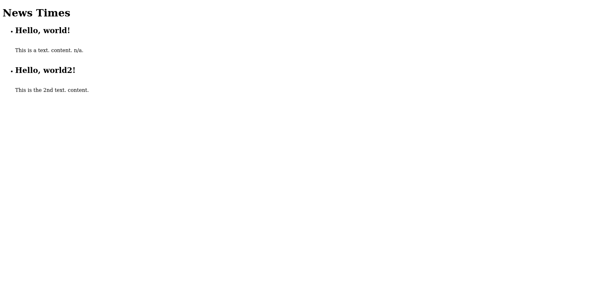
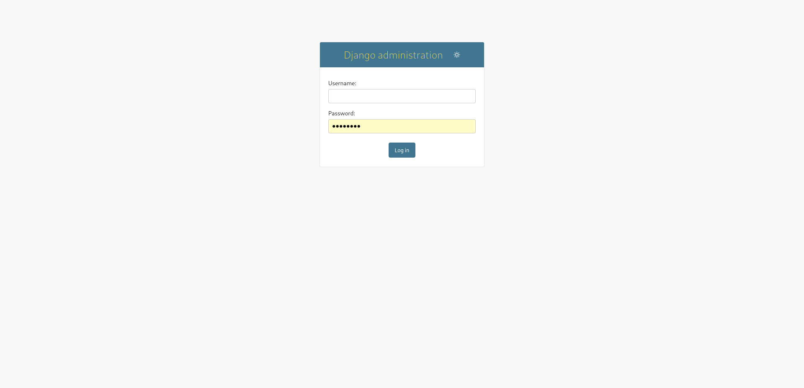
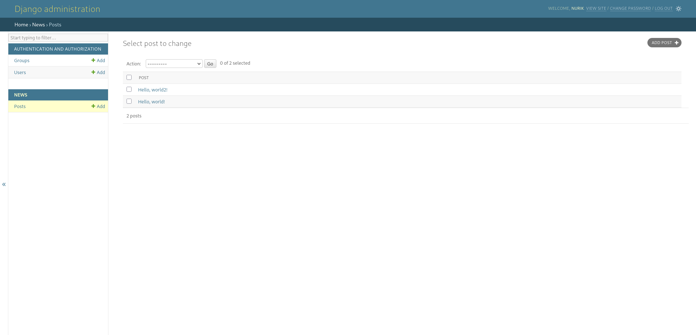

# News Times

A Django-based news application for creating, managing, and displaying news posts. Content is managed through Django's built-in admin interface and displayed on a clean home page.

## Pages

- **Home Page** (`/`) — Displays all news posts with titles and content
- **Admin Panel** (`/admin/`) — Full CRUD management for news posts

## Tech Stack

- **Python** 3.13
- **Django** 6.0.2
- **SQLite3** — Database
- **Pipenv** — Dependency management

## Project Structure

```
newsProject/
├── config/             # Django project configuration
│   ├── settings.py
│   ├── urls.py
│   └── wsgi.py
├── news/               # News app
│   ├── models.py       # Post model (title, text)
│   ├── views.py        # HomePageView (ListView)
│   ├── urls.py
│   ├── admin.py
│   └── tests.py
├── templates/
│   └── home.html       # Home page template
├── images/             # Screenshots
├── manage.py
├── Pipfile
└── db.sqlite3
```

## Getting Started

1. Clone the repository:
   ```bash
   git clone https://github.com/git-adventures/django-admin.git
   cd django-admin
   ```

2. Install dependencies:
   ```bash
   pipenv install
   ```

3. Activate the virtual environment:
   ```bash
   pipenv shell
   ```

4. Apply migrations:
   ```bash
   python manage.py migrate
   ```

5. Create a superuser (to access admin):
   ```bash
   python manage.py createsuperuser
   ```

6. Run the development server:
   ```bash
   python manage.py runserver
   ```

7. Open http://127.0.0.1:8000/ in your browser.

## Screenshots

<details>
<summary>Home Page</summary>

</details>

<details>
<summary>Admin Login</summary>

</details>

<details>
<summary>Admin - Post List</summary>

</details>
